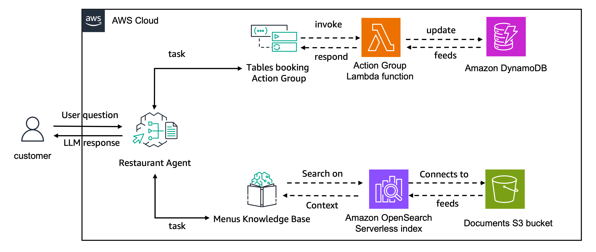

# Creating Agent with Knowledge Base and an Action Group

This project involves creating an agent with Amazon Bedrock and integrating it with a Knowledge Base and an Action Group. With this integration, the Agent will be able to respond to a user query by taking a sequence of actions, consulting the knowledge base to obtain more info, and executing tasks using the lambda function connected with an Action Group.

## Agent Architecture
Let's create a **AI-Powered Restaurant Assistant** agent that connects with a Knowledge Base containing the restaurant's different menus. This agent also connects to an action group that handles table booking. 

The action group created in this project uses [function details](https://docs.aws.amazon.com/bedrock/latest/userguide/agents-action-function.html) to define the functionalities for 
`create_booking`, `get_booking_details` and `delete_booking`.
The action group execution connects with a Lambda function that interacts with an Amazon DynamoDB table.

_Learn more_: [https://catalog.us-east-1.prod.workshops.aws/workshops/4c28c535-249d-44dc-939b-9f0942078336/en-US/50-create-agent-with-knowledge-base-and-action-group](https://catalog.us-east-1.prod.workshops.aws/workshops/4c28c535-249d-44dc-939b-9f0942078336/en-US/50-create-agent-with-knowledge-base-and-action-group)
